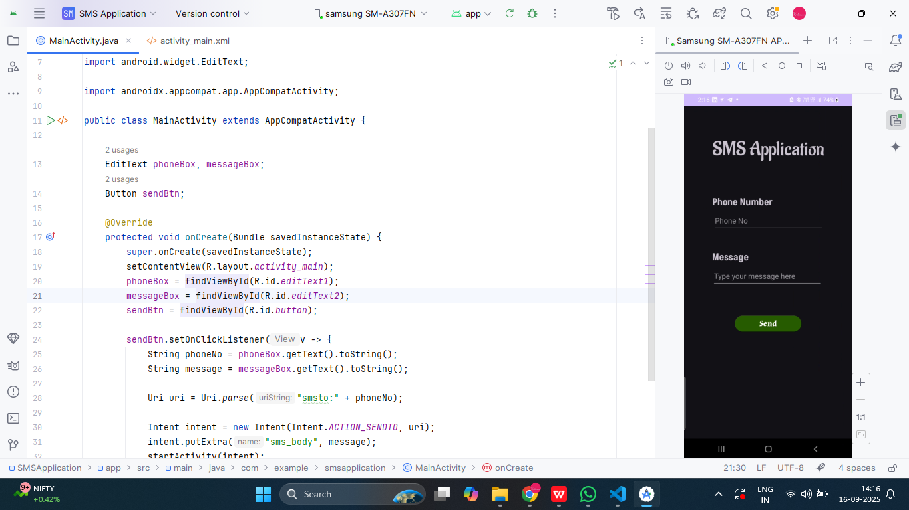
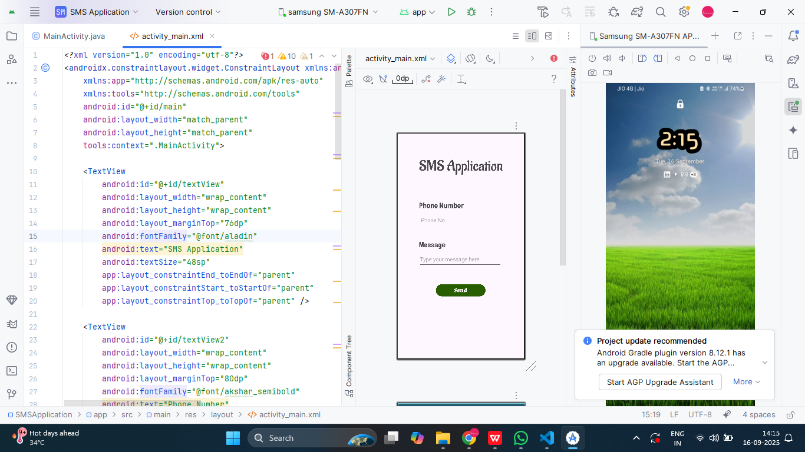
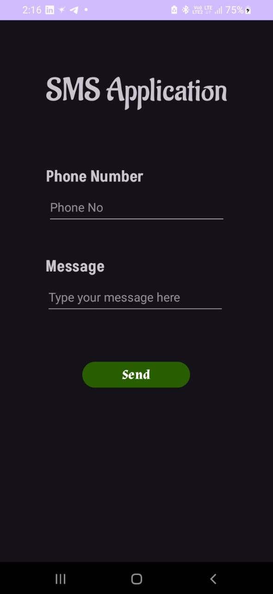
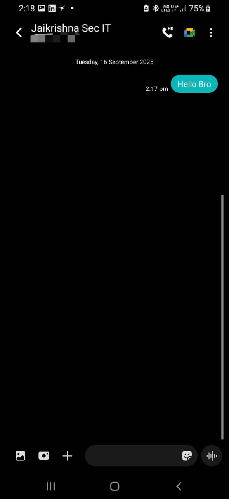

# Ex.No:3 Design an android application Send SMS using Intent.


## AIM:

To create and design an android application Send SMS using Intent using Android Studio.

## EQUIPMENTS REQUIRED:

Android Studio(Latest Version)

## ALGORITHM:

Step 1: Open Android Stdio and then click on File -> New -> New project.

Step 2: Then type the Application name as smsintent and click Next. 

Step 3: Then select the Minimum SDK as shown below and click Next.

Step 4: Then select the Empty Activity and click Next. Finally click Finish.

Step 5: Design layout in activity_main.xml.

Step 6: Send SMS and Display details give in MainActivity file.

Step 7: Save and run the application.

## PROGRAM:
```
/*
Program to create and design an android application Send SMS using Intent.
Developed by : VISHWARAJ G
Registeration Number : 212223220125
*/
package com.example.smsapplication;

import android.content.Intent;
import android.net.Uri;
import android.os.Bundle;
import android.widget.Button;
import android.widget.EditText;

import androidx.appcompat.app.AppCompatActivity;

public class MainActivity extends AppCompatActivity {

    EditText phoneBox, messageBox;
    Button sendBtn;

    @Override
    protected void onCreate(Bundle savedInstanceState) {
        super.onCreate(savedInstanceState);
        setContentView(R.layout.activity_main);
        phoneBox = findViewById(R.id.editText1);
        messageBox = findViewById(R.id.editText2);
        sendBtn = findViewById(R.id.button);

        sendBtn.setOnClickListener(v -> {
            String phoneNo = phoneBox.getText().toString();
            String message = messageBox.getText().toString();

            Uri uri = Uri.parse("smsto:" + phoneNo);

            Intent intent = new Intent(Intent.ACTION_SENDTO, uri);
            intent.putExtra("sms_body", message);
            startActivity(intent);
        });
    }
}
```

## OUTPUT

#### Coding Part


#### Design Part


#### App


#### SMS App


## RESULT
Thus a Simple Android Application create and design an android application Send SMS using Intent using Android Studio is developed and executed successfully.
